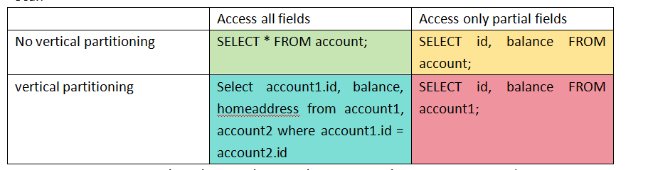
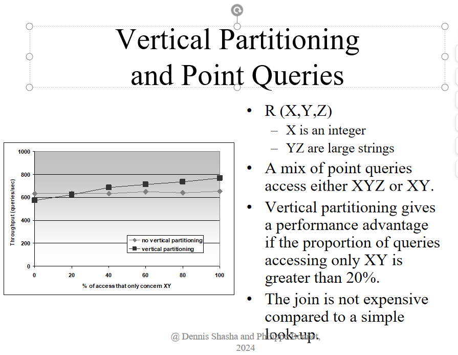
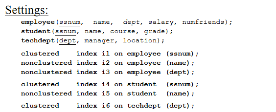
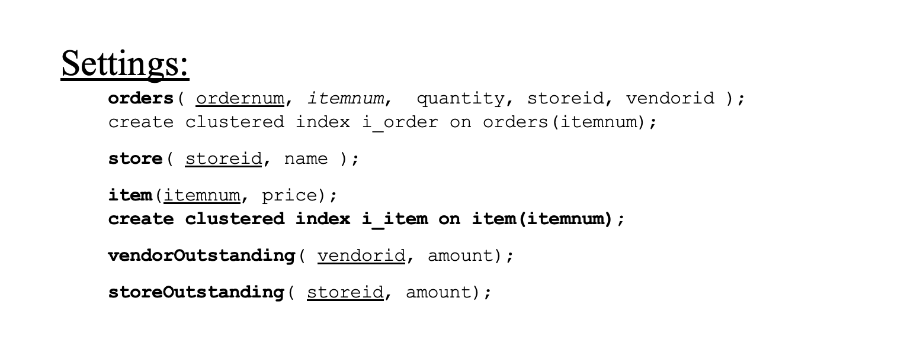
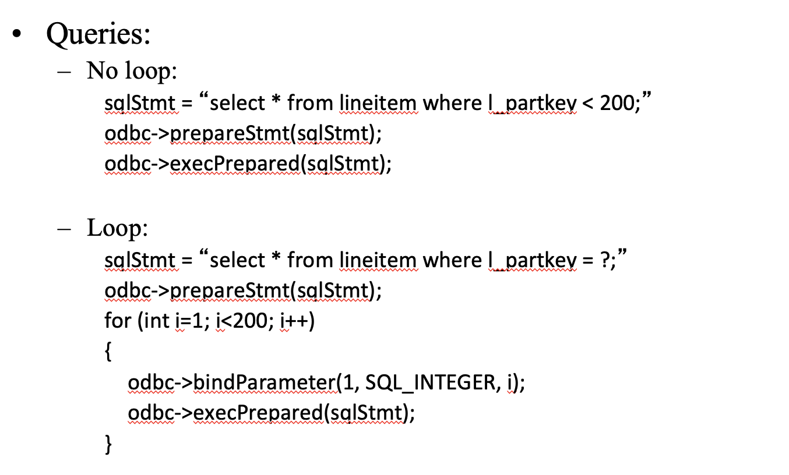
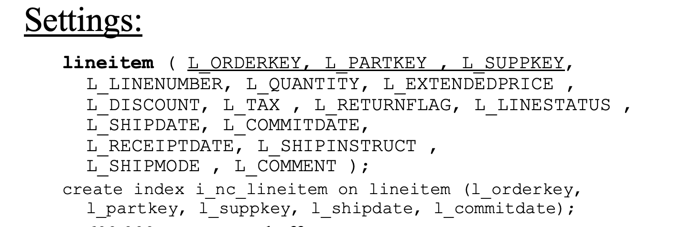
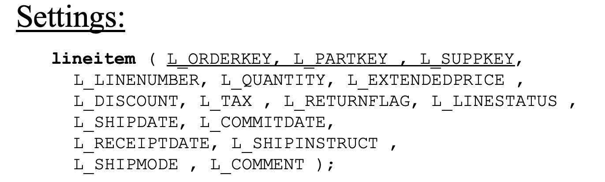
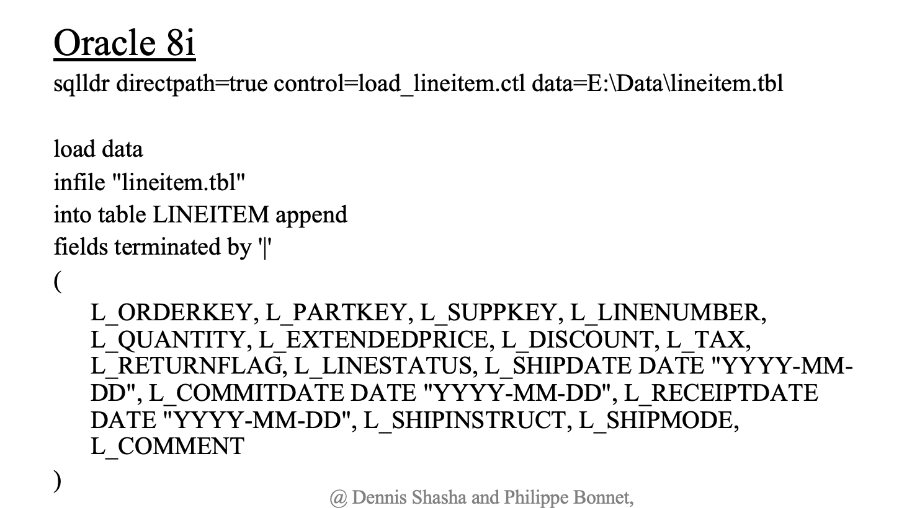
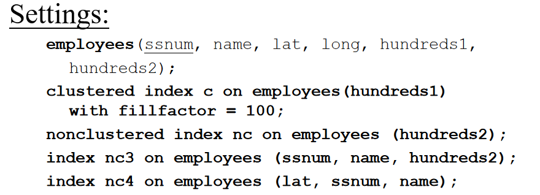
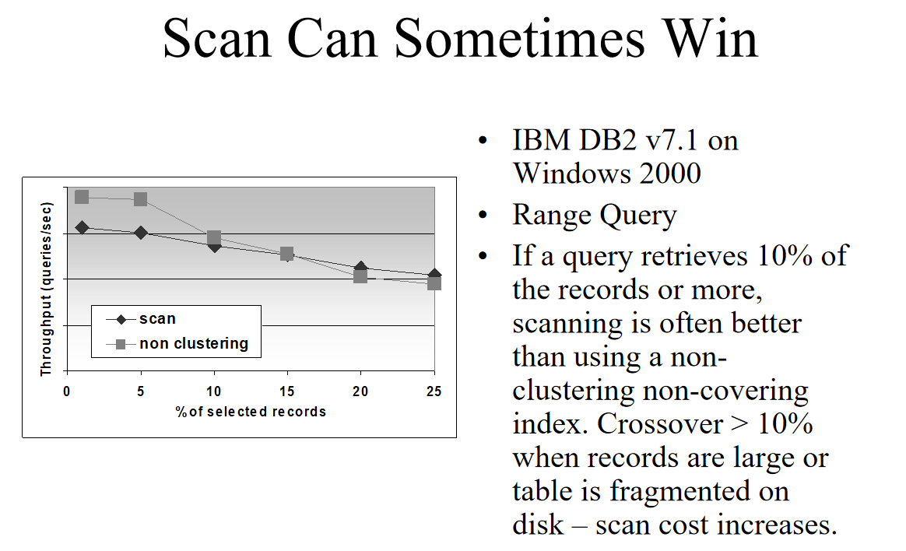

##  denormalization

schema

https://www.tpc.org/TPC_Documents_Current_Versions/pdf/TPC-H_v3.0.1.pdf

**data type**

only uniformly distributed data

**SF**

0.02 & 2

**with denormalization**

```sql
select L_ORDERKEY, L_PARTKEY, L_SUPPKEY, L_LINENUMBER,  L_QUANTITY, L_EXTENDEDPRICE,  L_DISCOUNT, L_TAX, L_RETURNFLAG, L_LINESTATUS, L_SHIPDATE, L_COMMITDATE, L_RECEIPTDATE, L_SHIPINSTRUCT, L_SHIPMODE, L_COMMENT, R_REGION
from lineitemdenormalized
where R_REGION = 'EUROPE';
```

**without denormalization**

```sql
select L_ORDERKEY, L_PARTKEY, L_SUPPKEY, L_LINENUMBER, L_QUANTITY, L_EXTENDEDPRICE, L_DISCOUNT, L_TAX, L_RETURNFLAG, L_LINESTATUS, L_SHIPDATE, L_COMMITDATE, L_RECEIPTDATE, L_SHIPINSTRUCT, L_SHIPMODE, L_COMMENT, R_NAME
from lineitem, region, supplier, nation
where
L_SUPPKEY = S_SUPPKEY
and S_NATIONKEY = N_NATIONKEY
and N_REGIONKEY = R_REGIONKEY
and R_NAME = 'EUROPE';
```


**mariadb** table creation

```sql
CREATE TABLE region (
    R_REGIONKEY INT,              -- Identifier for region (e.g., 0-4)
    R_NAME CHAR(25),              -- Fixed text, size 25
    R_COMMENT VARCHAR(152)        -- Variable text, size 152
);
LOAD DATA LOCAL INFILE '/data/tw3090/tpch/tpch10_5/region.tbl' 
INTO TABLE region
FIELDS TERMINATED BY '|'
LINES TERMINATED BY '\n';
```

```sql
CREATE TABLE nation (
    N_NATIONKEY INT,              -- Identifier for nation (e.g., 0-24)
    N_NAME CHAR(25),              -- Fixed text, size 25
    N_REGIONKEY INT,              -- Identifier, Foreign Key to R_REGIONKEY
    N_COMMENT VARCHAR(152)        -- Variable text, size 152
);

LOAD DATA LOCAL INFILE '/data/tw3090/tpch/tpch10_5/nation.tbl' 
INTO TABLE nation
FIELDS TERMINATED BY '|'
LINES TERMINATED BY '\n';

ALTER TABLE nation ADD PRIMARY KEY (N_NATIONKEY);

ALTER TABLE nation
ADD CONSTRAINT fk_nation_region FOREIGN KEY (N_REGIONKEY) REFERENCES region(R_REGIONKEY);
```

```sql
CREATE TABLE supplier (
    S_SUPPKEY INT,              -- Identifier, SF*10,000 suppliers are populated
    S_NAME CHAR(25),            -- Fixed text, size 25
    S_ADDRESS VARCHAR(40),      -- Variable text, size 40
    S_NATIONKEY INT,            -- Identifier, Foreign Key to N_NATIONKEY
    S_PHONE CHAR(15),           -- Fixed text, size 15
    S_ACCTBAL DECIMAL(15, 2),   -- Decimal value with precision and scale
    S_COMMENT VARCHAR(101)      -- Variable text, size 101
);

LOAD DATA LOCAL INFILE '/data/tw3090/tpch/tpch10_7/supplier.tbl' 
INTO TABLE supplier
FIELDS TERMINATED BY '|'
LINES TERMINATED BY '\n';

ALTER TABLE supplier ADD PRIMARY KEY (S_SUPPKEY);

ALTER TABLE supplier
ADD CONSTRAINT fk_supplier_nation FOREIGN KEY (S_NATIONKEY) REFERENCES nation(N_NATIONKEY);

```

```sql
CREATE TABLE partsupp (
    PS_PARTKEY INT,
    PS_SUPPKEY INT,
    PS_AVAILQTY INT,
    PS_SUPPLYCOST DECIMAL(15, 2),
    PS_COMMENT VARCHAR(44)
);

LOAD DATA LOCAL INFILE '/data/tw3090/tpch/tpch10_7/partsupp.tbl' 
INTO TABLE partsupp
FIELDS TERMINATED BY '|'
LINES TERMINATED BY '\n';

ALTER TABLE partsupp ADD PRIMARY KEY (PS_PARTKEY, PS_SUPPKEY);
ALTER TABLE partsupp ADD CONSTRAINT fk_partsupp_supplier FOREIGN KEY (PS_SUPPKEY) REFERENCES supplier(S_SUPPKEY);
```

```sql
CREATE TABLE lineitem (
    L_ORDERKEY INT,               -- Identifier, Foreign Key to O_ORDERKEY
    L_PARTKEY INT,
    L_SUPPKEY INT,                -- Identifier, Foreign Key to S_SUPPKEY
    L_LINENUMBER INT,                -- Integer
    L_QUANTITY DECIMAL(12, 2),       -- Decimal value for quantity
    L_EXTENDEDPRICE DECIMAL(15, 2),  -- Decimal value for extended price
    L_DISCOUNT DECIMAL(4, 2),        -- Decimal value for discount
    L_TAX DECIMAL(4, 2),             -- Decimal value for tax
    L_RETURNFLAG CHAR(1),            -- Fixed text, size 1
    L_LINESTATUS CHAR(1),            -- Fixed text, size 1
    L_SHIPDATE DATE,                 -- Date for shipping
    L_COMMITDATE DATE,               -- Date for commitment
    L_RECEIPTDATE DATE,              -- Date for receipt
    L_SHIPINSTRUCT CHAR(25),         -- Fixed text, size 25
    L_SHIPMODE CHAR(10),             -- Fixed text, size 10
    L_COMMENT VARCHAR(44)            -- Variable text, size 44
);

LOAD DATA LOCAL INFILE '/data/tw3090/tpch/tpch10_7/lineitem.tbl' 
INTO TABLE lineitem
FIELDS TERMINATED BY '|'
LINES TERMINATED BY '\n';

ALTER TABLE lineitem ADD PRIMARY KEY (L_ORDERKEY, L_LINENUMBER);
ALTER TABLE lineitem ADD CONSTRAINT fk_lineitem_partsupp1 FOREIGN KEY L_PARTKEY REFERENCES partsupp(PS_PARTKEY);
select count(*) from region;
ALTER TABLE lineitem ADD CONSTRAINT fk_lineitem_partsupp2 FOREIGN KEY L_SUPPKEY REFERENCES partsupp(PS_SUPPKEY);

ALTER TABLE lineitem ADD CONSTRAINT fk_lineitem_partsupp FOREIGN KEY (L_PARTKEY, L_SUPPKEY) REFERENCES partsupp(PS_PARTKEY, PS_SUPPKEY);
```

```sql
-- 1. empty table
CREATE TABLE lineitemdenormalized (
    L_ORDERKEY INT,
    L_LINENUMBER INT,
    L_PARTKEY INT,
    L_SUPPKEY INT,
    L_QUANTITY DECIMAL(12, 2),
    L_EXTENDEDPRICE DECIMAL(15, 2),
    L_DISCOUNT DECIMAL(4, 2),
    L_TAX DECIMAL(4, 2),
    L_RETURNFLAG CHAR(1),
    L_LINESTATUS CHAR(1),
    L_SHIPDATE DATE,
    L_COMMITDATE DATE,
    L_RECEIPTDATE DATE,
    L_SHIPINSTRUCT CHAR(25),
    L_SHIPMODE CHAR(10),
    L_COMMENT VARCHAR(44),
    R_REGION TEXT
);

-- 2. insert by using select
INSERT INTO lineitemdenormalized 
SELECT 
    L.L_ORDERKEY,
    L.L_LINENUMBER,
    L.L_PARTKEY,
    L.L_SUPPKEY,
    L.L_QUANTITY,
    L.L_EXTENDEDPRICE,
    L.L_DISCOUNT,
    L.L_TAX,
    L.L_RETURNFLAG,
    L.L_LINESTATUS,
    L.L_SHIPDATE,
    L.L_COMMITDATE,
    L.L_RECEIPTDATE,
    L.L_SHIPINSTRUCT,
    L.L_SHIPMODE,
    L.L_COMMENT,
    R.R_NAME AS R_REGION
FROM 
    lineitem L
JOIN 
    supplier S ON L.L_SUPPKEY = S.S_SUPPKEY
JOIN 
    nation N ON S.S_NATIONKEY = N.N_NATIONKEY
JOIN 
    region R ON N.N_REGIONKEY = R.R_REGIONKEY;


ALTER TABLE lineitemdenormalized ADD PRIMARY KEY (L_ORDERKEY, L_linenumber);
```

**duckdb** table creation

```sql
CREATE TABLE region (
    R_REGIONKEY INT primary key,              -- Identifier for region (e.g., 0-4)
    R_NAME CHAR(25),              -- Fixed text, size 25
    R_COMMENT VARCHAR(152)        -- Variable text, size 152
);

COPY region FROM '/data/tw3090/tpch/tpch10_4/region.tbl' (DELIMITER '|', HEADER FALSE);
```

```sql
CREATE TABLE nation (
    N_NATIONKEY INT primary key,              -- Identifier for nation (e.g., 0-24)
    N_NAME CHAR(25),              -- Fixed text, size 25
    N_REGIONKEY INT references region(R_REGIONKEY),              -- Identifier, Foreign Key to R_REGIONKEY
    N_COMMENT VARCHAR(152)        -- Variable text, size 152
);

COPY nation FROM '/data/tw3090/tpch/tpch10_8/nation.tbl' (DELIMITER '|', HEADER FALSE);
```

```sql
CREATE TABLE supplier (
    S_SUPPKEY INT primary key,              -- Identifier, SF*10,000 suppliers are populated
    S_NAME CHAR(25),            -- Fixed text, size 25
    S_ADDRESS VARCHAR(40),      -- Variable text, size 40
    S_NATIONKEY INT references nation(N_NATIONKEY),            -- Identifier, Foreign Key to N_NATIONKEY
    S_PHONE CHAR(15),           -- Fixed text, size 15
    S_ACCTBAL DECIMAL(15, 2),   -- Decimal value with precision and scale
    S_COMMENT VARCHAR(101)      -- Variable text, size 101
);

COPY supplier FROM '/data/tw3090/tpch/tpch10_7/supplier.tbl' (DELIMITER '|', HEADER FALSE);
```

```sql
CREATE TABLE partsupp (
    PS_PARTKEY INT,
    PS_SUPPKEY INT references supplier(S_SUPPKEY),
    PS_AVAILQTY INT,
    PS_SUPPLYCOST DECIMAL(15, 2),
    PS_COMMENT VARCHAR(44),
    PRIMARY KEY (PS_PARTKEY, PS_SUPPKEY)
);

COPY partsupp FROM '/data/tw3090/tpch/tpch10_7/partsupp.tbl' (DELIMITER '|', HEADER FALSE);
```

```sql
CREATE TABLE lineitem (
    L_ORDERKEY INT,               -- Identifier, Foreign Key to O_ORDERKEY
    L_PARTKEY INT,
    L_SUPPKEY INT,                -- Identifier, Foreign Key to S_SUPPKEY
    L_LINENUMBER INT,                -- Integer
    L_QUANTITY DECIMAL(12, 2),       -- Decimal value for quantity
    L_EXTENDEDPRICE DECIMAL(15, 2),  -- Decimal value for extended price
    L_DISCOUNT DECIMAL(4, 2),        -- Decimal value for discount
    L_TAX DECIMAL(4, 2),             -- Decimal value for tax
    L_RETURNFLAG CHAR(1),            -- Fixed text, size 1
    L_LINESTATUS CHAR(1),            -- Fixed text, size 1
    L_SHIPDATE DATE,                 -- Date for shipping
    L_COMMITDATE DATE,               -- Date for commitment
    L_RECEIPTDATE DATE,              -- Date for receipt
    L_SHIPINSTRUCT CHAR(25),         -- Fixed text, size 25
    L_SHIPMODE CHAR(10),             -- Fixed text, size 10
    L_COMMENT VARCHAR(44),            -- Variable text, size 44
primary key (L_ORDERKEY, L_LINENUMBER),
FOREIGN KEY (L_PARTKEY, L_SUPPKEY) REFERENCES partsupp(PS_PARTKEY, PS_SUPPKEY)
);

COPY lineitem FROM '/data/tw3090/tpch/tpch10_7/lineitem.tbl' (DELIMITER '|', HEADER FALSE);
```

```sql
CREATE TABLE lineitemdenormalized (
    L_ORDERKEY INT,
    L_LINENUMBER INT,
    L_PARTKEY INT,
    L_SUPPKEY INT,
    L_QUANTITY DECIMAL(12, 2),
    L_EXTENDEDPRICE DECIMAL(15, 2),
    L_DISCOUNT DECIMAL(4, 2),
    L_TAX DECIMAL(4, 2),
    L_RETURNFLAG CHAR(1),
    L_LINESTATUS CHAR(1),
    L_SHIPDATE DATE,
    L_COMMITDATE DATE,
    L_RECEIPTDATE DATE,
    L_SHIPINSTRUCT CHAR(25),
    L_SHIPMODE CHAR(10),
    L_COMMENT VARCHAR(44),
    R_REGION TEXT,
    PRIMARY KEY (L_ORDERKEY, L_LINENUMBER)
);

-- insert data
INSERT INTO lineitemdenormalized 
SELECT 
    L.L_ORDERKEY,
    L.L_LINENUMBER,
    L.L_PARTKEY,
    L.L_SUPPKEY,
    L.L_QUANTITY,
    L.L_EXTENDEDPRICE,
    L.L_DISCOUNT,
    L.L_TAX,
    L.L_RETURNFLAG,
    L.L_LINESTATUS,
    L.L_SHIPDATE,
    L.L_COMMITDATE,
    L.L_RECEIPTDATE,
    L.L_SHIPINSTRUCT,
    L.L_SHIPMODE,
    L.L_COMMENT,
    R.R_NAME AS R_REGION
FROM 
    lineitem L
JOIN 
    supplier S ON L.L_SUPPKEY = S.S_SUPPKEY
JOIN 
    nation N ON S.S_NATIONKEY = N.N_NATIONKEY
JOIN 
    region R ON N.N_REGIONKEY = R.R_REGIONKEY;
```

##  vertical partitioning

###  scan

**data type**

- only uniformly distributed data



**table creation**

```sql
CREATE TABLE account (
    id INT primary key, 
    balance text, 
    homeaddress text
);
CREATE TABLE account1 (
    id INT primary key, 
    balance text
);
CREATE TABLE account2 (
    id INT primary key, 
    homeaddress text
);
```

**query**

```sql
SELECT * FROM account;	
Select account1.id, balance, homeaddress from account1, account2 where account1.id = account2.id
SELECT id, balance FROM account;
SELECT id, balance FROM account1;
```


###  point query



we have 1 million rows, R has 1 million rows, R[X,Y] has 1 million rows, R[X,Z] has one million rows.

generate 100 queries

80% of access that only concern XY: 

- 80 of them are of the form Select X,Y from ... where X = ...
- 20 of them are of the form Select X,Y,Z from ... where X = ... 

see github experiement_design/query/vertical_partitioning_pointquery for queries provided for n = 0, 20, 40, 60, 80, 100

##  View on Join

**data type**

- uniformly distributed data
- fractally distributed data



**query**

1. create view

   ```sql
   create view techlocation as 
   select ssnum, techdept.dept, location 
   from employee, techdept 
   where employee.dept = techdept.dept;
   ```

2. queries

   with view on join

   ```sql
   select dept from techlocation where ssnum = 7891; -- becomes a join on employee, techdept.
   ```

   without view on join

   ```sql
   select dept from employee where ssnum = 7891;
   ```

**duckdb** table creation

since duckdb cannot do traditional clustered and unclustered index

use the following method to simulate

for techdept:

```  sh
 (head -n 1 techdept*.csv && tail -n +2 techdept*.csv | sort -t, -k1,1) > n_techdept_fractal_10_7.csv
```

for employee:

```  sh
# 1. get header
head -n 1 employee*.csv > n_employees_fractal_10_7.csv

# 2. randomize name,dept
tail -n +2 employee*.csv | awk -F, '{print $2}' | shuf --random-source=<(yes 42) > shuffled_name.txt
tail -n +2 employee*.csv | awk -F, '{print $3}' | shuf --random-source=<(yes 42) > shuffled_dept.txt
tail -n +2 employee*.csv | awk -F, '{print $1, $4, $5}' OFS=, > fixed_cols.txt

# 3. merge data
paste -d, fixed_cols.txt shuffled_name.txt shuffled_dept.txt >> n_employees_fractal_10_7.csv

# 4. clean temporary files
rm -rf shuffled_name.txt shuffled_dept.txt fixed_cols.txt

```

for student:

``` sh
# 1. get header
head -n 1 student*.csv > n_students_fractal_10_7.csv

# 2. randomize name
tail -n +2 student*.csv | awk -F, '{print $2}' | shuf --random-source=<(yes 42) > shuffled_name.txt
tail -n +2 student*.csv | awk -F, '{print $1}' > col1.txt 
tail -n +2 student*.csv | awk -F, '{print $3, $4}' OFS=, > col3_4.txt 

# 3. merge data
paste -d, col1.txt shuffled_name.txt col3_4.txt >> n_students_fractal_10_7.csv

# 4. clean temporary files
rm -rf shuffled_name.txt col1.txt col3_4.txt


```


```sql
CREATE TABLE techdept (
    dept VARCHAR(25) PRIMARY KEY,  -- Clustered index
    manager VARCHAR(25),
    location VARCHAR(50)
);

CREATE TABLE employee (
    ssnum INT PRIMARY KEY,  -- Clustered index
    name VARCHAR(25),
    dept VARCHAR(25) references techdept(dept),
    salary DECIMAL(10,2),
    numfriends INT
);

CREATE TABLE student (
    ssnum INT PRIMARY KEY,  -- Clustered index
    name VARCHAR(50),
    course VARCHAR(50),
    grade INT
);

COPY employee FROM '/data/tw3090/dept/fractal5/employees_fractal_10_5.csv' WITH (HEADER TRUE, DELIMITER ',');

COPY techdept FROM '/data/tw3090/dept/fractal5/n_techdept_fractal_10_5.csv' WITH (HEADER TRUE, DELIMITER ',');

COPY student FROM '/data/tw3090/dept/fractal5/students_fractal_10_5.csv' WITH (HEADER TRUE, DELIMITER ',');

CREATE INDEX i1 ON employee (ssnum);   -- ART index
CREATE INDEX i2 ON employee (name);    
CREATE INDEX i3 ON employee (dept);   
CREATE INDEX i4 ON student (ssnum);    
CREATE INDEX i5 ON student (name);   
CREATE INDEX i6 ON techdept (dept);   

```

**mariadb** table creation

```sql
CREATE TABLE techdept (
    dept VARCHAR(25),  -- Clustered index
    manager VARCHAR(25),
    location VARCHAR(50)
);

CREATE TABLE employee (
    ssnum INT,  -- Clustered index (默认)
    name VARCHAR(25),
    dept VARCHAR(25),
    salary DECIMAL(10,2),
    numfriends INT
);

CREATE TABLE student (
    ssnum INT,  -- Clustered index
    name VARCHAR(50),
    course VARCHAR(50),
    grade INT
);

LOAD DATA LOCAL INFILE '/data/tw3090/dept/fractal5/employees_fractal_10_7.csv'
INTO TABLE employee
FIELDS TERMINATED BY ','
LINES TERMINATED BY '\n'
IGNORE 1 ROWS;


LOAD DATA LOCAL INFILE '/data/tw3090/dept/fractal5/techdept_fractal_10_7.csv'
INTO TABLE techdept
FIELDS TERMINATED BY ','
LINES TERMINATED BY '\n'
IGNORE 1 ROWS;


LOAD DATA LOCAL INFILE '/data/tw3090/dept/fractal5/students_fractal_10_7.csv'
INTO TABLE student
FIELDS TERMINATED BY ','
LINES TERMINATED BY '\n'
IGNORE 1 ROWS;


-- key
ALTER TABLE employee 
ADD PRIMARY KEY (ssnum);

ALTER TABLE student 
ADD PRIMARY KEY (ssnum);

ALTER TABLE techdept 
ADD PRIMARY KEY (dept);

ALTER TABLE employee 
ADD CONSTRAINT fk_employee_dept 
FOREIGN KEY (dept) REFERENCES techdept(dept);

-- index
CREATE UNIQUE CLUSTERED INDEX i1 ON employee (ssnum);  -- MySQL InnoDB default PK is Clustered
CREATE INDEX i2 ON employee (name);
CREATE INDEX i3 ON employee (dept);

CREATE UNIQUE CLUSTERED INDEX i4 ON student (ssnum);  -- MySQL InnoDB default PK is Clustered
CREATE INDEX i5 ON student (name);

CREATE UNIQUE CLUSTERED INDEX i6 ON techdept (dept);  -- MySQL InnoDB default PK is Clustered

```

##  correlated subqueries

**table**

use employee techdpt student

**data type**

- uniformly distributed data
- fractally distributed data

**query**

with correlated subqueries

```sql
select ssnum 
from employee e1 
where salary =
    (select max(salary)
     from employee e2
     where e2.dept = e1.dept);
```

rewritten

```sql
-- template, not using!!
select max(salary) as bigsalary, dept
into TEMP 
from employee group by dept;

select ssnum
from employee, TEMP
where salary = bigsalary
and employee.dept = temp.dept;

-- 1.
SELECT e1.ssnum
FROM employee e1
JOIN (
    SELECT dept, MAX(salary) AS bigsalary
    FROM employee
    GROUP BY dept
) e2 
ON e1.dept = e2.dept AND e1.salary = e2.bigsalary;

-- 2.
WITH max_salary_per_dept AS (
    SELECT dept, MAX(salary) AS bigsalary
    FROM employee
    GROUP BY dept
)
SELECT e1.ssnum
FROM employee e1
JOIN max_salary_per_dept m
ON e1.dept = m.dept AND e1.salary = m.bigsalary;

```

##  eliminate unneeded distinct

**table**

use employee techdpt student

**data type**

- uniformly distributed data
- fractally distributed data

**query**

without eliminating unneeded distinct

```sql
SELECT DISTINCT ssnum
FROM employee, techdept
WHERE employee.dept = techdept.dept;

```

with eliminating unneeded distinct

```sql
SELECT ssnum
FROM employee, techdept
WHERE employee.dept = techdept.dept;
```

##  Looping can hurt

**table**

use TPC_H dataset



**query**



No loop

```sql
SELECT * FROM lineitem WHERE l_partkey < 200;
```

Loop

```sql
DELIMITER //
CREATE PROCEDURE get_lineitems()
BEGIN
    DECLARE i INT DEFAULT 1;
    
    -- declare PREPARE
    PREPARE stmt FROM 'SELECT * FROM lineitem WHERE l_partkey = ?';

    WHILE i < 200 DO
        SET @param = i;
        EXECUTE stmt USING @param;
        SET i = i + 1;
    END WHILE;

    -- release prepared statement
    DEALLOCATE PREPARE stmt;

END //
DELIMITER ;


CALL get_lineitems();
```

no duckdb

## Cursors are death

**table**

Use employee dataset


**data type**

- uniformly distributed data

**table creation**

```sql
CREATE TABLE employees (
    ssnum INT primary key,
    name VARCHAR(255),
    lat DECIMAL(10,2),
    longitude DECIMAL(10,2),  -- change long → longitude
    hundreds1 INT,
    hundreds2 INT
);

    
LOAD DATA LOCAL INFILE '/data/tw3090/employee/employeesindex_10_7.csv'
INTO TABLE employees
FIELDS TERMINATED BY ','
LINES TERMINATED BY '\n'
IGNORE 1 ROWS;

COPY employees FROM '/data/tw3090/employee/employeesindex_10_7.csv' WITH (HEADER TRUE, DELIMITER ',');

ALTER TABLE employees ADD PRIMARY KEY (ssnum);

```


**query**

No cursor

```sql
select * from employees;
```

Cursor

```sql
DECLARE d_cursor CURSOR FOR select * from employees;
OPEN d_cursorwhile (@@FETCH_STATUS = 0)
BEGIN
    FETCH NEXT from d_cursorEND
CLOSE d_cursor
go
```

```sql
--  for mariadb
--  use store procedure
DELIMITER //

CREATE PROCEDURE fetch_employees()
BEGIN
    DECLARE done INT DEFAULT FALSE;
    DECLARE emp_ssnum INT;
    DECLARE emp_name VARCHAR(255);
    DECLARE emp_lat DECIMAL(10,2);
    DECLARE emp_longitude DECIMAL(10,2);
    DECLARE emp_hundreds1 INT;
    DECLARE emp_hundreds2 INT;

    -- DECLARE cursor
    DECLARE emp_cursor CURSOR FOR 
        SELECT ssnum, name, lat, longitude, hundreds1, hundreds2 FROM employees;

    -- finish dealing with cursor
    DECLARE CONTINUE HANDLER FOR NOT FOUND SET done = TRUE;

    -- open cursor
    OPEN emp_cursor;

    -- read cursor
    read_loop: LOOP
        FETCH emp_cursor INTO emp_ssnum, emp_name, emp_lat, emp_longitude, emp_hundreds1, emp_hundreds2;
        IF done THEN
            LEAVE read_loop;
        END IF;
        
        -- print line by line
        SELECT emp_ssnum AS SSN, emp_name AS Name, emp_lat AS Latitude, emp_longitude AS Longitude, emp_hundreds1, emp_hundreds2;
    END LOOP;

    -- close cursor
    CLOSE emp_cursor;
END//

DELIMITER ;

```

no duckdb

## Retrieve Needed Columns

**table**

use TPC_H dataset



```sql
create index i_nc_lineitem on lineitem (l_orderkey, l_partkey, l_suppkey, l_shipdate, l_commitdate);
```


**query**

All

```sql
SELECT * FROM lineitem;
```

Covered Subset

```sql
Select l_orderkey, l_partkey, l_suppkey, l_shipdate, l_commitdate from lineitem;
```

## Bulk Loading Data

###  direct path

**table**

use TPC_H dataset



**query**



use .py files to implement insert

###  batch size


use .py files to implement insert

##  clustered index

**table**

employees



Let's say there are N rows in the employee table.
For long, lat, hundreds1, hundreds2, name, create a set of vectors having N/100 values for each of them.
Permute those values independently.

hundreds1: 1, 3, 8, 6, 3, ... up to the Nth number
hundreds2: 12, 28, 2, 4, .... up to Nth number

There will be repeats because while there N rows, there are only N/100 distinct values for each of these attributes

```sql
-- if no explict clustered/nonclustered index
CREATE INDEX idx_c ON employees (hundreds1); 
CREATE INDEX idx_nc ON employees (hundreds2);
CREATE INDEX idx_nc3 ON employees (ssnum, name, hundreds2);
CREATE INDEX idx_nc4 ON employees (lat, ssnum, name);
```


**query**

clustered index

```sql
select * from employees where hundreds1 = 800; 
```

nonclustered index

```sql
select * from employees where hundreds2= 800;
```

no index

```sql
select * from employees where longitude = 8018.02;-- 10^5
select * from employees where longitude = 2108;-- 10^7
```


##  covering index


**query**

covering 

```sql
select ssnum, name from employees where lat = 4009.01;-- 10^5
select ssnum, name from employees where lat = 1054;-- 10^7
```

covering - not ordered

```sql
select ssnum, hundreds2 from employees where name = 'name10';
```


##  scan wins



1. index (hundreds2)
2. no index(longitude)

```sql
--  10^5
select * from employees where hundreds2 = 150; -- 0%
select * from employees where hundreds2 < 150; -- 5%
select * from employees where hundreds2 < 200; -- 10%
select * from employees where hundreds2 < 250; -- 15%
select * from employees where hundreds2 < 300; -- 20%
select * from employees where hundreds2 < 350; -- 25%

-- 10^7
select * from employees where hundreds2 = 5100; -- 0%
select * from employees where hundreds2 < 5100; -- 5%
select * from employees where hundreds2 < 10100; -- 10%
select * from employees where hundreds2 < 15100; -- 15%
select * from employees where hundreds2 < 20100; -- 20%
select * from employees where hundreds2 < 25100; -- 25%


```

```sql
-- 10^5
select * from employees where longitude = 150;
select * from employees where longitude < 150;
select * from employees where longitude < 200;
select * from employees where longitude < 250;
select * from employees where longitude < 300;
select * from employees where longitude < 350;
-- 10^7
select * from employees where longitude = 5100;
select * from employees where longitude < 5100;
select * from employees where longitude < 10100;
select * from employees where longitude < 15100;
select * from employees where longitude < 20100;
select * from employees where longitude < 25100;
```

##  b-tree vs hash

for 

##  Aggregate Maintenance --triggers

store dataset (only uniform dataset)

Setting:
```sql
create clustered index i_item on item(itemnum);

create trigger updateVendorOutstanding on orders for insert as
update vendorOutstanding
set amount = 
	(select vendorOutstanding.amount+sum(inserted.quantity*item.price)
	from inserted,item
	where inserted.itemnum = item.itemnum
	)
where vendorid = (select vendorid from inserted) ;

create trigger updateStoreOutstanding on orders for insert as
update storeOutstanding
set amount = 
	(select storeOutstanding.amount+sum(inserted.quantity*item.price)
	 from inserted,item
	 where inserted.itemnum = item.itemnum
	)
where storeid = (select storeid from inserted)
```

Insert
```sql
insert into orders values (1000350,7825,562,'xxxxxx6944','vendor4');
```

Without redundant tables
```sql
select orders.vendor, sum(orders.quantity*item.price)
		from orders,item
		where orders.itemnum = item.itemnum
		group by orders.vendorid;
```
```sql
select store.storeid, sum(orders.quantity*item.price)
		from orders,item, store
		where orders.itemnum = item.itemnum
  		  and orders.storename = store.name
		group by store.storeid;
```

With redundant tables
```sql
select * from vendorOutstanding;
```
```sql
select * from storeOutstanding;
```

## Multidimensional Indexes -- queries

polygon dataset (to be generated)

The following codes might only work for mysql and need to find equivalent data types for GEOMETRY in other dbms.

Creating table
```sql
CREATE TABLE spatial_facts (
    id INT AUTO_INCREMENT PRIMARY KEY,
    a1 INT, a2 INT, a3 INT, a4 INT, a5 INT, a6 INT, a7 INT, a8 INT, a9 INT, a10 INT
);

#Insert data

ALTER TABLE spatial_facts ADD COLUMN geom_a3_a7 GEOMETRY NOT NULL;

UPDATE spatial_facts 
SET geom_a3_a7 = ST_GeomFromText(CONCAT('POINT(', a3, ' ', a7, ')'));
```

Creating Index
```sql
ALTER TABLE spatial_facts ADD SPATIAL INDEX r_spatialfacts (geom_a3_a7);

CREATE INDEX b2_spatialfacts ON spatial_facts(a3, a7);
```

Point Query
```sql
select count(*) from fact where a3 = 694014 and a7 = 928878;

SELECT COUNT(*)
FROM spatial_facts
WHERE ST_Equals(
    geom_a3_a7, 
    ST_GeomFromText('POINT(694014 928878)')
);
```

Range Query
```sql
select count(*) from spatial_facts where a3 > 10 and a3 < 1000000 and a7 > 800000 and a7 < 1000000;

SELECT COUNT(*)
FROM spatial_facts
WHERE ST_Within(
    geom_a3_a7, 
    ST_PolygonFromText('POLYGON((10 800000, 1000000 800000, 1000000 1000000, 10 1000000, 10 800000))')
);
```

## Value of Serializeable

Look at mysql_concurrency.sh

Settings
```sql
accounts( number, branchnum,  balance);
create clustered index c on accounts(number);
```

Thread 1
```mysql
select sum(balance) from accounts;
```

Thread 2
```mysql
START TRANSACTION;
UPDATE accounts a1
JOIN accounts a2 ON a1.number = a2.number - 1
SET a1.balance = a2.balance, a2.balance = a1.balance
WHERE a1.number % 2 = 1;
COMMIT;
```
